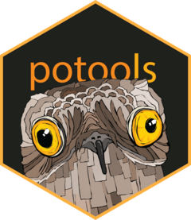

# potools: Tools for Portability and Internationalization of R packages 

## Overview

R users are a global community. From Xiamen to Santiago, Addis Ababa to Tbilisi, Ogallala to Adelaide, R users are legion and speak many different languages. To serve these diverse communities, R includes built-in tools based on the [GNU gettext system](https://www.gnu.org/software/gettext/) that make it possible to translate user-facing communications like messages, warnings, and errors. Unfortunately, this system uses new file types (`.pot` templates, `.po` files, and `.mo` binaries) that come with their own quirks and idiosyncrasies. The goal of potools is make it as easy as possible to translate your package by abstracting away as many details of the gettext system as possible.

The potool logo features a [potoo](https://en.wikipedia.org/wiki/Potoo) and was designed by [Allison Horst](https://www.allisonhorst.com).

## Installation

Start by installing the released version potools from CRAN:

```R
install.packages("potools")
```

Or the development version from GitHub:

```R
# install.packages("remotes")
remotes::install_github("MichaelChirico/potools")
```

You'll also need to install gettext, the GNU command line toolkit that powers potools. Installation depends on your operating system:

* On Windows, gettext is bundled with [Rtools](https://cran.r-project.org/bin/windows/Rtools/), so if you're developing packages you probably already have it.

* On Mac, it's easiest to install with [brew](https://brew.sh): `brew install gettext`

* On Linux, it's usually already installed; otherwise you'll need to install `gettext` with your distro's standard tool.

## Workflow

There are two core workflows provided by potools:

* `translate_package()` is a one-stop-shop for interactively setting your package and providing  translations, as described in `?translate_package`.

* `po_extract()`, `po_create()`, `po_update()`, and `po_compile()` let you perform the individual steps of `translate_package()` as described in `vignette("developers")` and `vignette("translators")`.

## Alternative software

`potools` is by no means the first tool for facilitating internationalization; other open-source projects have deeper
experience in this domain and as a result there are some relatively mature options for working with gettext/the po
ecosystem in general. Here is a smattering of such tools that I've come across:

 - Poedit - https://poedit.net/ - GUI Software for writing translations
 - Gtranslator - https://wiki.gnome.org/Apps/Gtranslator - GNOME Translation editor
 - Lokalize - https://userbase.kde.org/Lokalize - KDE's Computer-Aided Translation system
 - Virtaal - https://virtaal.translatehouse.org/?id=virtaal/index - Another FOSS software for translation
 - Pootle - https://pootle.translatehouse.org/ - Apparently related to Virtaal, and apparently there's even [a paper](https://www.academia.edu/16211610/A_Comparative_Study_of_Two_FOSS_Localisation_Tools_Pootle_and_Virtaal) written comparing the two
 - Localization Toolkit - https://toolkit.translatehouse.org/ - Again I'm not sure the difference vs. Virtaal & Pootle
 - PO mode in Emacs - https://www.emacswiki.org/emacs/PoMode
